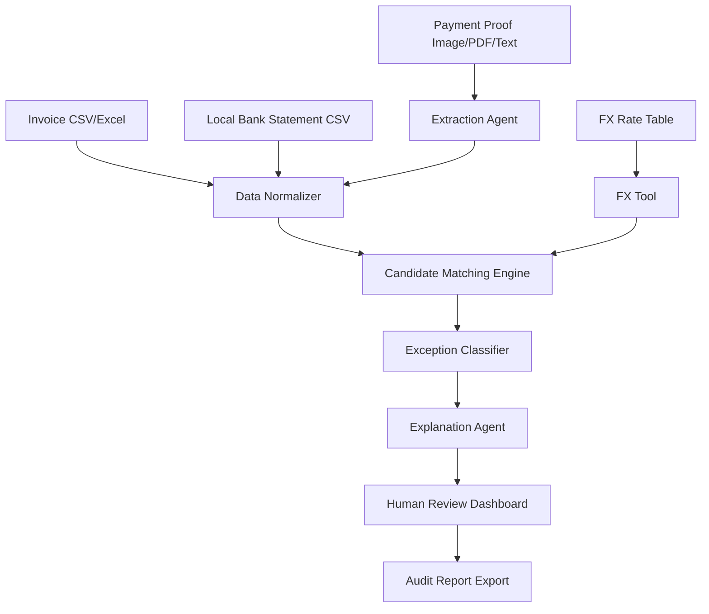

# ReconPilot Deep Market Analysis

Date: 2026-05-22  
Context: AI Marathon 2026 treasury problem statement  
Concept: SME-focused, document-first FX reconciliation agent

## Executive Verdict

ReconPilot is **not novel** if we pitch it as "AI reconciliation software." That market already exists.

Enterprise reconciliation vendors already automate matching, cash application, remittance capture, exception queues, audit trails, ERP/bank integrations, and some FX/multicurrency handling. SME accounting tools already do bank feeds, rules, suggested matches, and multicurrency accounting. OCR/document tools already extract invoices, receipts, bank statements, and remittance data.

The defensible hackathon wedge is narrower:

> ReconPilot is an exception-first FX reconciliation agent for SMEs. It reads messy payment proofs, invoice files, FX rates, and local bank statements, then explains why a foreign-currency payment does or does not match a local bank deposit.

This can work for the hackathon because it is concrete, visual, agentic, and tied to the mission. But if the demo is only "upload invoice and bank statement, AI finds a match," it is generic and weak.

## Problem Being Solved

SMEs that receive international payments often invoice customers in one currency, but receive money locally in another currency.

Example:

```text
Invoice: INV-1001, USD 100
Local bank received: RM 423.80
```

The finance/admin person must decide:

- Is this the correct payment?
- Which FX rate date explains it?
- Was a bank fee deducted?
- Is it a partial payment?
- Is the reference missing or wrong?
- Does the sender name match the customer?
- Should the transaction be approved, rejected, or reviewed?

That is the real pain. Reconciliation is not just matching equal numbers. It is explaining mismatches with enough evidence for month-end close.

## Market Map

| Category | Examples | What They Already Do | Our Gap |
|---|---|---|---|
| Enterprise reconciliation and cash application | Ledge, BlackLine, HighRadius, Esker, SAP, Oracle, Kyriba, AutoRek, Simetrik, Tesorio, Versapay, Bectran | High-volume transaction matching, cash application, remittance capture, exception queues, audit workflows, ERP/bank/payment integrations, multicurrency in some cases | Too enterprise-heavy. We can be file-first, SME-focused, and demo-simple. |
| SME accounting tools | Xero, QuickBooks, Zoho Books, Odoo | Bank feeds, suggested matches, bank rules, invoice/payment matching, multicurrency accounting | They assume records are already inside the accounting system. We handle messy proof files before posting. |
| Payment platforms | Stripe, PayPal, Wise, Synder, A2X | Payout reconciliation, fees, settlement currency, platform-specific reports, ecommerce payout matching | They work inside their own rails. We handle arbitrary payment proofs and local bank CSVs. |
| Document AI / OCR | Nanonets, Docsumo, Veryfi, Rossum, Dext, AutoEntry, Google Document AI, Azure Document Intelligence | Extract invoices, receipts, bank statements, remittances, tables, and structured fields | Extraction is not enough. Our wedge is FX reasoning, exception classification, and audit trail. |

## Enterprise Competitor Analysis

| Product | Target Customer | Relevant Capabilities | FX / Multicurrency | Gap vs ReconPilot |
|---|---|---|---|---|
| [Ledge Payment Reconciliation](https://www.ledge.co/solutions/payment-reconciliation) | Finance/payment operations teams | Reconciles across ERPs, banks, processors, refunds, chargebacks, fees, timing differences, unstructured memos, audit trails | Explicitly handles FX variances, exchange-rate differences, processor fees, and settlement timing | Closest scary competitor. Our wedge must be SME/no-ERP upload flow, not enterprise reconciliation. |
| [BlackLine Transaction Matching](https://www.blackline.com/products/financial-close/transaction-matching/) | Enterprise finance and close teams | High-volume matching, exception handling, transaction matching, reconciliation controls | Handles broad transaction matching; foreign exchange impact appears in BlackLine materials | Too enterprise/close oriented. We should not compete on scale or control depth. |
| [HighRadius Cash Application](https://www.highradius.com/cash-application-automation/) | Enterprise AR teams | Remittance capture, invoice matching, payment splitting, bank statement processing, ERP posting, AI agents | Mentions complex global cash application and currency capture in supporting material | Owns high-volume AR automation. We compete on clear SME explanation, not auto-posting rate. |
| [Esker Cash Application](https://www.esker.com/solutions/cash-application/) | Large receivables teams | AI extraction, autonomous matching, exception workspace, human validation, audit-ready visibility | Explicitly mentions multi-currency complexity, underpayments, overpayments, deductions, withholding tax | Already overlaps with explainable cash application. Our wedge must be narrower and demo-specific. |
| [SAP Cash Application](https://www.sap.com/use-cases/reduce-accounts-receivable-matching-effort) | SAP S/4HANA customers | ML-based receivables matching, bank statement item clearing, payment advice extraction | FX not the main public headline for cash application | Deep ERP workflow. Our gap is pre-ERP messy-file investigation. |
| [Oracle Cash Management](https://docs.oracle.com/en/cloud/saas/financials/24c/faipp/reconciliation-matching-rules.html) | Oracle enterprise finance teams | Reconciliation matching rules, one-to-many/many-to-many matching, automatic reconciliation | Oracle Cash Management docs cover foreign-currency transaction reconciliation | Rule-heavy enterprise infrastructure. We should not build configurable enterprise matching. |
| [Kyriba](https://www.kyriba.com/resource/liquidity-performance-platform/) | Treasury teams | Cash visibility, liquidity, payments, bank connectivity, reconciliation, FX exposure and hedging | Strong treasury/FX coverage | A treasury command center, not a lightweight SME proof matcher. |
| [AutoRek](https://autorek.com/cash-reconciliations/) | Financial institutions and high-volume finance teams | Multi-currency cash reconciliation, exception handling, dashboards, audit-ready reports | Explicit multi-currency and FX/cross-currency support in clearing/settlement | Institutional scale. We avoid regulated high-volume reconciliation claims. |
| [Simetrik](https://simetrik.com/platform) | PSPs, marketplaces, banks, neobanks, platform finance teams | Multi-way reconciliation, ETL, fee validation, audit logs, agentic AI workflows | Lists FX and crypto management / automatic FX handling | Platform-scale reconciliation. We focus on one SME workflow. |
| [Tesorio Cash Application](https://www.tesorio.com/product/cash-application) | AR teams | Cash application agent, email remittance processing, partial payments, confidence-ranked exceptions | Multicurrency not the clearest public claim, but multi-entity and complex matching are present | Very close on agent/confidence/exceptions. We need FX-date reasoning as the visible differentiator. |
| [Versapay Cash Application](https://www.versapay.com/solutions/cash-application) | AR teams | OCR, remittance capture, payment-to-invoice matching, short-pay/deduction routing, ERP posting | FX not prominent in reviewed public page | Strong cash-app competitor. We must not pitch generic payment matching. |
| [Bectran AI Cash App](https://www.bectran.com/ai/ai-cash-app) | AR/order-to-cash teams | Remittance ingestion, bank/remittance inbox capture, exception queues, audit trail | Supports multiple currencies and regional business rules | Heavy overlap on docs + multicurrency + exceptions. Our wedge is simple SME upload + explainable FX timeline. |

### Enterprise Pattern

Enterprise tools already own:

- high-volume matching engines;
- cash application automation;
- remittance capture;
- exception queues;
- approval workflows;
- ERP/bank/payment-processor integrations;
- audit trails;
- AI/ML branding;
- multicurrency or FX handling in several products.

So we must **not** claim we are an enterprise reconciliation platform. That would be a joke.

## SME Accounting and Payment Platform Analysis

| Product | Relevant Capabilities | Overlap | Limitation / Gap |
|---|---|---|---|
| [Xero Bank Reconciliation](https://www.xero.com/us/accounting-software/reconcile-bank-transactions/) | AI-powered and bank-rule-driven suggested matches, bank feeds, bulk matching, reconciliation reports | Strong once invoices/payments/bank transactions live in Xero | Not a standalone messy payment-proof investigation workflow. |
| [Xero Multicurrency](https://developer.xero.com/documentation/best-practices/data-integrity/multicurrency/) | Multicurrency documents, payments, bank transactions, realised FX gains/losses | Strong multicurrency accounting | Requires accounting-system setup and correct data entry. |
| [QuickBooks Online Matching](https://quickbooks.intuit.com/learn-support/en-us/help-article/bank-transactions/match-transactions-quickbooks-online/L0MF3Fn6y_US_en_US) | Matches downloaded bank transactions to existing invoices, receipts, bills, and records | Strong bookkeeping workflow | Not focused on arbitrary external payment proofs plus FX-date explanation. |
| [QuickBooks Multicurrency](https://quickbooks.intuit.com/learn-support/en-us/help-article/multicurrency/learn-multicurrency-quickbooks-online/L5krkKQi8_US_en_US) | Foreign-currency customers, vendors, and accounts | Covers multicurrency records | Still inside QuickBooks. |
| [Zoho Books Reconciliation](https://www.zoho.com/in/books/bank-connect-reconciliation/) | Best/possible matches, bank feeds/imports, bulk matching, partial/installment/consolidated payments | Very strong SME accounting competitor | Broad accounting software, not a focused AI explanation layer for foreign proof vs local bank row. |
| [Odoo Bank Reconciliation](https://www.odoo.com/documentation/18.0/applications/finance/accounting/bank/reconciliation.html) | Reconciliation models, matching bank transactions with invoices/bills/payments | Strong ERP accounting workflow | Requires ERP setup; not no-ERP upload workflow. |
| [Stripe Payout Reconciliation](https://docs.stripe.com/reports/payout-reconciliation?locale=en-GB) | Matches bank payouts to payment batches, fees, currency fields | Strong for Stripe payouts | Stripe-specific; does not handle arbitrary bank transfers/proofs. |
| [PayPal Disbursement Reconciliation](https://developer.paypal.com/beta/reports/financial-reports/disbursement-reconciliation-report/) | Settlement amount, settlement currency, exchange rate, transfer IDs, fees | Strong for PayPal reports | PayPal-specific. |
| [Wise API](https://docs.wise.com/api-reference/balance-statement) | Multi-currency balances, statements in JSON/CSV/PDF/XLSX/CAMT.053/MT940/QIF, fees/conversions | Useful for structured multicurrency account data | Only if money flows through Wise. |
| [Synder](https://synder.com/product/multi-channel-sync/) | Syncs sales, fees, taxes, payouts, currency conversions from platforms to accounting systems | Strong ecommerce/payment-platform reconciliation | Integration-heavy, platform-centric. |
| [A2X](https://support.a2xaccounting.com/en/articles/4449231-a2x-overview-for-accountants-and-bookkeepers) | Ecommerce payout summaries that match deposits in accounting systems | Strong ecommerce payout reconciliation | Not general payment-proof investigation. |
| [Dext](https://dext.com/us/business/products/bank-statements-extraction) / [Hubdoc](https://www.xero.com/accounting-software/capture-data-with-hubdoc/) | Receipt/invoice/bank-statement capture and extraction | Strong document prep for accounting | Extraction-first, not FX reconciliation reasoning. |

### SME Platform Pattern

Commodity features:

- suggested bank matches;
- bank rules;
- invoice/payment matching;
- bank statement import;
- receipt/invoice OCR;
- multicurrency accounting;
- payout reconciliation for Stripe/PayPal/ecommerce.

Do not make these the headline. They are expected.

## Document AI / OCR Analysis

| Product | Extraction Capabilities | Reconciliation Support | Gap |
|---|---|---|---|
| [Nanonets Automated Reconciliation](https://nanonets.com/automated-reconciliation) | Bank statements, invoices, purchase orders, ledgers, document-backed review | Strong transaction matching, partial/unmatched detection, exception review, audit trail | Very close. We must narrow to SME cross-border payment proof + FX-date reasoning. |
| [Docsumo Financial Services](https://www.docsumo.com/solutions/idp-for-financial-services) | Invoices, remittance advice, statements, bank statements, anomalies, duplicates | More IDP/extraction/validation than exact FX proof-to-bank matching | Imitate extraction confidence, not broad IDP. |
| [Veryfi](https://www.veryfi.com/) | Receipts, invoices, checks, bank statements, expense reports, structured APIs | Has revenue reconciliation positioning | Strong extraction platform; our value is exception logic, not OCR. |
| [Rossum](https://rossum.ai/solutions/accounts-payable/) | AP invoice automation and validation | AP workflows | Outbound/vendor focused, not incoming customer FX payments. |
| [Dext Bank Statement Extraction](https://dext.com/us/business/products/bank-statements-extraction) | Bank statement PDF/TIFF extraction | Prepares accounting workflows | Not a reconciliation brain. |
| [AutoEntry](https://www.autoentry.com/) | Receipts, invoices, statements, financial documents | Supplier statement reconciliation | More AP/document-entry than incoming payment matching. |
| [Ramp AP](https://ramp.com/accounts-payable) | Invoice OCR, AP agents, approval workflows | AP/bill pay automation | Avoid AP. |
| [Brex Bill Pay](https://www.brex.com/support/bill-pay-overview) | Invoice OCR, AP workflow | AP/bill pay | Avoid AP. |
| [Google Document AI](https://docs.cloud.google.com/document-ai/docs/pretrained-overview) | Prebuilt parsers for bank statements, invoices, expenses | Infrastructure, not full reconciliation | Use/imitate structured extraction schemas. |
| [Azure Document Intelligence](https://learn.microsoft.com/en-us/azure/ai-services/document-intelligence/overview) | Text, tables, key-value pairs, invoices, receipts, checks, bank statements | Infrastructure, not full reconciliation | Use/imitate confidence + extraction outputs. |

### OCR Pattern

OCR is not the product. It is plumbing.

For hackathon reliability:

- use clean sample files;
- use LLM/vision or pre-extracted JSON fallback;
- show extraction confidence;
- let users correct fields;
- never let OCR errors silently drive final finance decisions.

## Customer Segment

### Primary ICP

Small international service/export SMEs:

- 5-100 employees;
- receives overseas customer payments;
- invoices in USD/SGD/EUR/AUD;
- receives local bank deposits in MYR;
- uses Excel, bank portal exports, email/WhatsApp payment proofs;
- may use Xero/QuickBooks/Zoho, but still reconciles messy evidence manually;
- no enterprise ERP or dedicated treasury tool.

Examples:

- digital agencies serving foreign clients;
- training providers with overseas customers;
- small exporters;
- event/conference operators;
- ecommerce sellers handling off-platform bank transfers;
- B2B service firms.

### Secondary ICP

Bookkeepers and small accounting firms handling multiple SME clients.

They are attractive because they see this pain repeatedly and care about audit trails. They are risky because they may demand accounting integrations and security guarantees beyond hackathon scope.

## Jobs To Be Done

### Functional Jobs

- Match foreign invoices to local bank deposits.
- Extract amounts, dates, currencies, references, and senders from messy files.
- Compare invoice-date, payment-date, and bank-received-date FX rates.
- Decide whether a payment is matched, likely matched, needs review, duplicate, partial, or unmatched.
- Produce review notes for month-end close.

### Emotional Jobs

- Stop guessing whether a mismatch is FX, fee, or underpayment.
- Feel confident before approving reconciliation.
- Avoid embarrassing accounting mistakes.
- Reduce month-end stress.

### Social Jobs

- Explain the decision to a manager/client.
- Show evidence during audit or review.
- Prove the finance admin did not just "AI guess" the result.

## Opportunity-Solution Tree

Desired outcome:

> Reduce time and uncertainty for SME finance admins reconciling cross-border customer payments.

### Opportunity 1: "I struggle to know which bank deposit belongs to which foreign invoice."

Solutions:

- multi-signal matching: reference, sender, amount, date, currency;
- candidate match ranking;
- confidence and reason codes.

Validation:

- 10 synthetic reconciliation cases;
- compare manual matching time vs ReconPilot;
- success: 50% faster and 80%+ correct user agreement.

### Opportunity 2: "I do not know why the amount is different."

Solutions:

- FX date comparison panel;
- variance classifier: FX, bank fee, short payment, overpayment, duplicate, partial, combined;
- suggested next action.

Validation:

- show 6 mismatch explanations to finance/accounting students or SME admins;
- success: 4/5 users can choose approve/review/reject confidently.

### Opportunity 3: "Payment evidence is messy."

Solutions:

- payment proof extraction agent;
- manual correction screen;
- source evidence preview.

Validation:

- test 10 sample proofs;
- success: 90% extraction accuracy on amount/currency/date/reference for demo-quality files.

### Opportunity 4: "I need an audit trail, not just an AI answer."

Solutions:

- reasoning timeline;
- human approval states;
- Markdown/PDF/CSV audit export.

Validation:

- ask 5 users if the report is enough for internal review;
- success: 4/5 say yes.

## Risky Assumptions

| Risk Category | Assumption | Confidence | Failure Mode | Test |
|---|---|---:|---|---|
| Value | SMEs feel enough pain to care. | Medium | Many SMEs may only have a few foreign payments monthly. | Interview 5 SME admins/bookkeepers about their last month-end close. |
| Value | Exception explanation matters more than raw matching. | High | Users may just want accounting-system integration. | Compare simple match table vs reasoning timeline. |
| Usability | Users understand FX-date reasoning. | Medium | The UI may feel too accounting-heavy. | Ask non-finance users to explain a match back after seeing the panel. |
| Feasibility | Payment proof extraction is reliable enough. | Medium | OCR/LLM misreads numbers and kills trust. | Use controlled files and manual correction fallback. |
| Feasibility | Matching logic can be built fast. | High if scoped | Too many cases create bugs. | Build deterministic fixtures before UI polish. |
| Viability | File-first workflow is acceptable. | Medium | Users may hate preparing files manually. | Concierge test with sample files. |
| Strategy | This is differentiated enough for judges. | Medium | Other teams may also pick Treasury. | Make FX-date panel + audit timeline the demo centerpiece. |
| Ethics | AI suggestions with human approval are acceptable. | High | Black-box auto-approval would be irresponsible. | Keep explicit review states; no autoposting. |

## Differentiation Strategy

Weak pitch:

> AI-powered bank reconciliation.

Better pitch:

> ReconPilot explains cross-border payment mismatches for SMEs before month-end close.

Best hackathon pitch:

> A lightweight investigation layer before accounting entry: payment proof -> FX/date reasoning -> local bank match -> human approval -> audit trail.

### What We Should Make Visibly Different

1. **FX Date Reasoning Panel**
   - invoice-date rate;
   - payment-date rate;
   - bank-received-date rate;
   - best explanation.

2. **Exception-First Dashboard**
   - exact match;
   - likely match;
   - missing reference;
   - bank fee / short payment;
   - partial payment;
   - duplicate;
   - combined payment.

3. **Evidence Timeline**
   ```text
   Invoice INV-1008: USD100
   Payment-date FX: 4.25
   Expected: RM425.00
   Bank received: RM423.80
   Variance: RM1.20
   Reference matches
   Sender partial match
   Status: Likely Match
   Action: approve or request fee proof
   ```

4. **Human Approval**
   - `Matched`
   - `Likely Match`
   - `Needs Review`
   - `Rejected`
   - `Approved by Human`

5. **No-ERP Upload Mode**
   - invoice CSV/Excel;
   - bank statement CSV;
   - payment proof image/PDF/text;
   - FX rate table.

## Hackathon Scope

### Must Build

- invoice list import;
- bank statement import;
- payment proof extraction or fixture fallback;
- local FX rate table by date;
- deterministic matching engine;
- FX date comparison;
- exception classifier;
- explanation agent;
- review dashboard;
- audit export.

### Should Cut

- live bank integration;
- real accounting-system integration;
- live FX API dependency;
- all currencies;
- journal entries;
- tax handling;
- fraud detection platform;
- ERP posting;
- full OCR robustness;
- Web3 wallet mechanics.

## Recommended MVP Cases

Use 4-5 cases only:

| Case | Why It Matters |
|---|---|
| Exact match | Judges understand the baseline instantly. |
| FX date mismatch | Shows maturity and differentiation. |
| Missing reference + fuzzy sender | Shows agentic reasoning beyond exact matching. |
| Bank fee / short payment | Shows exception-first value. |
| Combined payment for two invoices | Optional; shows one-to-many matching if time allows. |

## Agent Architecture



LLM responsibilities:

- extract fields from messy text/proofs;
- generate explanation;
- summarize audit notes;
- orchestrate tool calls for demo.

Deterministic code responsibilities:

- FX conversion;
- arithmetic;
- amount variance;
- date tolerance;
- reference matching;
- sender fuzzy match;
- confidence scoring;
- final status classification.

## Sponsor/API Strategy

Use Chutes or Morpheus as OpenAI-compatible inference for extraction and explanation. Do not make Web3 the product.

Suggested deck phrasing:

> ReconPilot uses sponsor-compatible decentralized inference for document understanding and explanation, while deterministic reconciliation tools handle FX math, matching, confidence, and audit state.

Avoid:

- MOR token/staking content;
- Bittensor/miner explanations;
- using both Chutes and Morpheus just for logo points;
- claiming blockchain solves reconciliation.

## Validation Plan

### Experiment 1: Manual vs ReconPilot Time Test

Give users 10 synthetic cases. Compare manual spreadsheet matching vs ReconPilot output.

Success:

- 50% faster;
- 80%+ correct decisions;
- users can explain the result.

### Experiment 2: Explanation Trust Test

Show two versions:

- A: match table + confidence;
- B: match table + FX/date/evidence timeline.

Success:

- 70% prefer version B;
- users cite concrete trust reasons.

### Experiment 3: Demo Fixture Accuracy

Run automated tests for:

- exact match;
- FX date mismatch;
- missing reference;
- bank fee/short payment;
- partial payment;
- combined payment.

Success:

- 100% deterministic classification pass rate;
- LLM only explains after classification.

## Final Recommendation

Build ReconPilot only if the team commits to the narrow wedge:

> Exception-first, date-aware FX reconciliation for SME payment proofs.

The product should not be a finance chatbot or a generic reconciliation platform. The winning demo is a small workflow with deterministic math and a clear explanation trail.

### Build Order

1. Demo fixtures.
2. Matching engine.
3. FX date comparison.
4. Exception classifier.
5. Reasoning timeline.
6. Review dashboard.
7. LLM explanation layer.
8. Upload polish.

### Kill Criteria

Kill or pivot if:

- deterministic matching is not working after the first build session;
- the demo depends on live OCR/API with no fallback;
- the output is just a confidence score;
- the team cannot explain the problem in one sentence;
- the UI hides the evidence trail.

## Final Positioning

> ReconPilot is an AI-assisted reconciliation review layer for SMEs. It turns messy foreign payment proofs, invoices, FX rates, and local bank statements into explainable matches and review-ready exceptions.

## Source List

### Enterprise Reconciliation

- Ledge Payment Reconciliation: https://www.ledge.co/solutions/payment-reconciliation
- BlackLine Transaction Matching: https://www.blackline.com/products/financial-close/transaction-matching/
- BlackLine Cash Application: https://www.blackline.com/map-for-cash-application/
- HighRadius Cash Application: https://www.highradius.com/cash-application-automation/
- Esker Cash Application: https://www.esker.com/solutions/cash-application/
- SAP Cash Application: https://www.sap.com/use-cases/reduce-accounts-receivable-matching-effort
- SAP Help: Machine Learning Based Cash Application: https://help.sap.com/docs/SAP_S4HANA_CLOUD/b8c08e0197454541a11f8d46ef1ab96e/31d4fa87b01445b9b3479123e6f56ea7.html
- Oracle Reconciliation Matching Rules: https://docs.oracle.com/en/cloud/saas/financials/24c/faipp/reconciliation-matching-rules.html
- Oracle Cash Management Multicurrency: https://docs.oracle.com/cd/A60725_05/html/comnls/us/ce/overvi04.htm
- Oracle Account Reconciliation: https://www.oracle.com/europe/performance-management/account-reconciliation/
- Kyriba Liquidity Performance Platform: https://www.kyriba.com/resource/liquidity-performance-platform/
- AutoRek Cash Reconciliations: https://autorek.com/cash-reconciliations/
- AutoRek Clearing and Settlement: https://autorek.com/processing-clearing-settlement-reconciliations/
- Simetrik Platform: https://simetrik.com/platform
- Tesorio Cash Application: https://www.tesorio.com/product/cash-application
- Versapay Cash Application: https://www.versapay.com/solutions/cash-application
- Bectran AI Cash App: https://www.bectran.com/ai/ai-cash-app

### SME Accounting and Payment Platforms

- Xero Bank Reconciliation: https://www.xero.com/us/accounting-software/reconcile-bank-transactions/
- Xero Multicurrency Developer Docs: https://developer.xero.com/documentation/best-practices/data-integrity/multicurrency/
- Xero Central Multicurrency: https://central.xero.com/s/article/About-multicurrency
- Hubdoc: https://www.xero.com/accounting-software/capture-data-with-hubdoc/
- QuickBooks Reconciliation: https://quickbooks.intuit.com/learn-support/en-us/help-article/statement-reconciliation/reconcile-account-quickbooks-online/L3XzsllsK_US_en_US
- QuickBooks Match Transactions: https://quickbooks.intuit.com/learn-support/en-us/help-article/bank-transactions/match-transactions-quickbooks-online/L0MF3Fn6y_US_en_US
- QuickBooks Multicurrency: https://quickbooks.intuit.com/learn-support/en-us/help-article/multicurrency/learn-multicurrency-quickbooks-online/L5krkKQi8_US_en_US
- Zoho Books Banking: https://www.zoho.com/books/help/banking/
- Zoho Books Bank Reconciliation: https://www.zoho.com/in/books/bank-connect-reconciliation/
- Odoo Bank Reconciliation: https://www.odoo.com/documentation/18.0/applications/finance/accounting/bank/reconciliation.html
- Odoo Multicurrency: https://www.odoo.com/documentation/18.0/applications/finance/accounting/get_started/multi_currency.html
- Stripe Payout Reconciliation: https://docs.stripe.com/reports/payout-reconciliation?locale=en-GB
- PayPal Disbursement Reconciliation: https://developer.paypal.com/beta/reports/financial-reports/disbursement-reconciliation-report/
- Wise Balance Statement API: https://docs.wise.com/api-reference/balance-statement
- Wise Rate API: https://docs.wise.com/api-docs/api-reference/rate
- Synder Multi-Channel Sync: https://synder.com/product/multi-channel-sync/
- A2X Overview: https://support.a2xaccounting.com/en/articles/4449231-a2x-overview-for-accountants-and-bookkeepers
- Dext Bank Statement Extraction: https://dext.com/us/business/products/bank-statements-extraction

### Document AI / OCR

- Nanonets Automated Reconciliation: https://nanonets.com/automated-reconciliation
- Docsumo Financial Services IDP: https://www.docsumo.com/solutions/idp-for-financial-services
- Veryfi: https://www.veryfi.com/
- Veryfi Bank Statement API Docs: https://docs.veryfi.com/api/bank-statements/process-a-bank-statement/
- Rossum Accounts Payable: https://rossum.ai/solutions/accounts-payable/
- AutoEntry: https://www.autoentry.com/
- Ramp Accounts Payable: https://ramp.com/accounts-payable
- Brex Bill Pay: https://www.brex.com/support/bill-pay-overview
- Google Document AI Pretrained Parsers: https://docs.cloud.google.com/document-ai/docs/pretrained-overview
- Azure Document Intelligence: https://learn.microsoft.com/en-us/azure/ai-services/document-intelligence/overview
