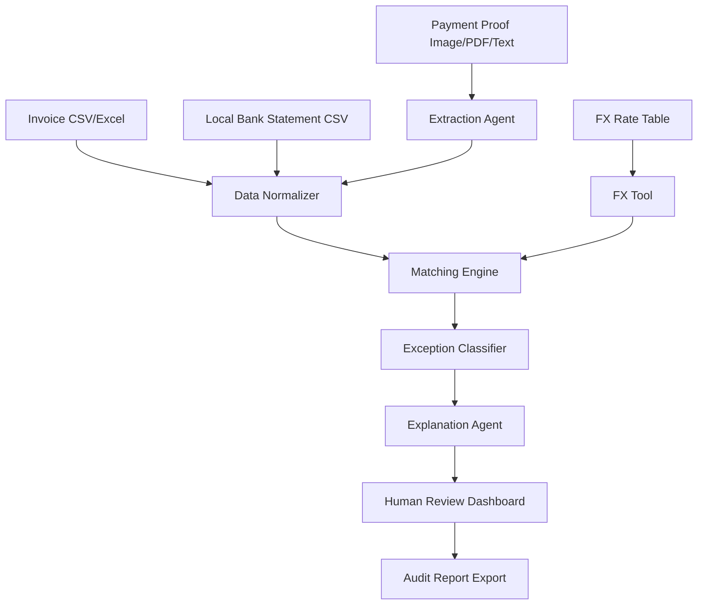

# ReconPilot Market Positioning Report

Date: 2026-05-22  
Context: AI Marathon 2026 hackathon, Treasury problem statement  
Product concept: SME-focused, document-first FX reconciliation agent

## Executive Verdict

ReconPilot is **not novel as "AI reconciliation software."** That category already exists across enterprise reconciliation platforms, accounting tools, payment processors, and OCR/document automation products.

The hackathon-worthy wedge is narrower:

> ReconPilot is an exception-first FX reconciliation agent for SMEs that explains why foreign payment proofs, invoices, FX dates, and local bank deposits do or do not match.

This can be novel enough for the hackathon if the demo focuses on **messy payment evidence, date-aware FX reasoning, mismatch explanations, confidence, human approval, and audit trail**. If the product only does "upload invoice + bank statement -> AI match," it is generic and weak.

## Market Reality

### Existing Product Categories

| Category | Examples | What They Already Do | Why ReconPilot Still Has a Wedge |
|---|---|---|---|
| Enterprise reconciliation platforms | Ledge, BlackLine, HighRadius, Esker, Trintech, AutoRek | High-volume reconciliation, transaction matching, exception workflows, fees, FX variance, audit flows | Too enterprise-heavy for small teams. Setup and integrations are the product. ReconPilot can be file-first and demo-simple. |
| SME accounting tools | Xero, QuickBooks, Zoho Books | Bank feeds, invoice/payment matching, rules, multicurrency accounting | They assume accounting-system adoption and cleaner bookkeeping workflows. ReconPilot can work before data is posted into accounting software. |
| Payment processor reports | Stripe, PayPal, Wise | Reconcile payouts, fees, settlement currency, exchange rates, platform-specific reports | They only explain their own ecosystem. ReconPilot can handle arbitrary payment proofs and local bank CSVs. |
| OCR/document automation | Nanonets, Veryfi, Docsumo, Rossum, Dext, AutoEntry | Extract invoice, receipt, remittance, bank-statement fields | Extraction is not the wedge. The wedge is reconciliation reasoning and exception explanation. |

### Competitor Notes

- [Ledge](https://www.ledge.co/solutions/payment-reconciliation) directly mentions reconciliation across currencies, FX variances, timing differences, platform fees, audit trails, approvals, and reporting. This is the closest scary competitor.
- [BlackLine Transaction Matching](https://www.blackline.com/products/financial-close/transaction-matching/) covers high-volume matching, exception handling, bank fees, foreign exchange impact, and multiple invoices to one payment.
- [Nanonets automated reconciliation](https://nanonets.com/automated-reconciliation) claims AI reconciliation across bank statements, invoices, partial payments, discounts, chargebacks, and audit trails.
- [Xero multicurrency](https://central.xero.com/s/article/About-multicurrency) supports invoices and payments in 160+ currencies and hourly exchange-rate updates. Xero's developer docs also explain realised currency gains/losses when invoices are paid at different rates.
- [Stripe payout reconciliation](https://docs.stripe.com/reports/payout-reconciliation?locale=en-GB) helps match bank payouts with payment batches and includes fee/currency fields, but is Stripe-specific.
- [PayPal Disbursement Reconciliation Report](https://developer.paypal.com/beta/reports/financial-reports/disbursement-reconciliation-report/) includes settlement currency and exchange-rate fields for reconciling payout flows, but is PayPal-specific.
- Zoho Books supports bank matching workflows and multi-currency accounting, but public user discussions show multi-currency matching can still be awkward in real workflows.

## Market Positioning

### Bad Positioning

Avoid these:

- "AI-powered bank reconciliation."
- "Automated invoice matching."
- "A smarter Xero."
- "We replace accountants."
- "We revolutionize SME treasury."

These are either generic, false, or too broad.

### Stronger Positioning

Use this:

> ReconPilot helps SME finance teams reconcile cross-border payments from messy files by explaining FX, fee, date, and reference mismatches before month-end close.

Shorter pitch:

> Explainable FX reconciliation for SME payment proofs.

Hackathon pitch:

> We turn foreign invoices, payment proofs, FX rates, and local bank statements into explainable matches and review-ready exceptions.

### Competitive Wedge

ReconPilot should not compete with enterprise platforms on automation breadth. It should compete on:

1. **File-first workflow**
   - Upload invoice Excel/CSV, payment proof image/PDF, local bank statement CSV.
   - No ERP, bank feed, or payment-processor integration required for MVP.

2. **Date-aware FX reasoning**
   - Compare invoice-date FX, payment-date FX, and bank-received-date FX.
   - Explain which rate best accounts for the received amount.

3. **Exception-first output**
   - Not just "matched."
   - Explain short payment, bank fee, missing reference, duplicate payment, partial payment, combined payment, wrong FX date.

4. **Human approval**
   - Finance users should not trust black-box AI with money.
   - Statuses: Matched, Likely Match, Needs Review, Rejected, Approved.

5. **Audit trail**
   - Every match should show extracted fields, calculations, evidence, confidence, and decision history.

## ICP

### Primary ICP

**Small international service/export SME finance admin**

Profile:

- 5-100 employees.
- Receives cross-border customer payments.
- Uses Excel, bank portal exports, PDFs, WhatsApp/email payment proofs.
- May use Xero/QuickBooks/Zoho, but still does manual checking outside the system.
- No full ERP or dedicated treasury system.
- Local bank account in MYR; invoices may be USD, SGD, EUR, AUD.

Example businesses:

- Digital agencies serving foreign clients.
- Training/education providers with overseas students/customers.
- Small exporters.
- B2B service firms.
- E-commerce sellers receiving platform/bank payouts.
- Event or conference teams receiving foreign transfers.

### Secondary ICP

**Bookkeepers/accounting service providers handling multiple SME clients**

Why useful:

- They see this pain repeatedly across clients.
- They value audit trails and exception notes.
- They may pay for time-saving tools.

Risk:

- They may already use accounting software deeply.
- They may need more integrations than a hackathon MVP can support.

## Jobs To Be Done

### Functional Jobs

- Match foreign invoices to local bank deposits.
- Understand why expected amount and received amount differ.
- Extract payment information from screenshots/PDFs/Excel.
- Decide whether a payment is fully paid, partially paid, duplicated, or suspicious.
- Prepare a review note for month-end close.

### Emotional Jobs

- Feel confident that money was not missed or double-counted.
- Avoid looking careless during audit or owner review.
- Reduce stress during month-end.
- Stop manually hunting across bank portals, spreadsheets, and proof screenshots.

### Social Jobs

- Show the manager/client a clear explanation.
- Justify why a payment was approved, rejected, or escalated.
- Prove that the finance admin did not guess.

## Opportunity-Solution Tree

Desired outcome:

> Reduce time and uncertainty for SME finance admins reconciling cross-border customer payments.

### Opportunity 1: "I struggle to know which bank deposit belongs to which foreign invoice."

Solutions:

- Multi-signal matching engine using reference, sender, amount, date, and currency.
- Confidence scoring with reason codes.
- Candidate match ranking instead of one forced answer.

Experiments:

- Give 5 finance/accounting students or SME admins 10 synthetic cases. Compare manual matching time vs ReconPilot.
- Success threshold: 50% faster matching and users agree with 80%+ of system decisions.

### Opportunity 2: "I do not know whether the difference is FX, bank fee, partial payment, or an error."

Solutions:

- Date-aware FX comparison panel.
- Variance classifier: FX difference, fee, short pay, overpay, duplicate, missing reference.
- "Suggested next action" notes.

Experiments:

- Show users 6 mismatch explanations and ask them to choose whether they would approve, reject, or review.
- Success threshold: 4/5 users say the explanation is sufficient to take the next action.

### Opportunity 3: "Payment proof data is messy and arrives as screenshots, PDFs, and Excel."

Solutions:

- Payment proof extraction agent.
- Manual correction screen for extracted fields.
- Source evidence preview beside extracted fields.

Experiments:

- Upload 10 controlled payment proof samples and measure extraction accuracy.
- Success threshold: 90% amount/currency/date/reference extraction on demo-quality files.

### Opportunity 4: "I need an audit trail, not just an AI answer."

Solutions:

- Reconciliation reasoning timeline.
- Human approval states.
- Exportable Markdown/PDF/CSV audit report.

Experiments:

- Ask users whether the exported report would be acceptable for internal review.
- Success threshold: 4/5 users say yes after seeing one exact match and two exceptions.

## Risky Assumptions

| Category | Risky Assumption | Confidence | Why It Could Fail | Test |
|---|---|---:|---|---|
| Value | SMEs feel enough pain to care about this workflow. | Medium | Some SMEs may only have a few foreign payments monthly. | Interview 5 SME admins/bookkeepers; ask about last month-end reconciliation, not opinions. |
| Value | Exception explanations matter more than raw auto-matching. | High | Users may prefer direct integration into accounting tools. | Show two prototypes: simple match table vs reasoning timeline. Measure preference. |
| Usability | Users understand FX date reasoning. | Medium | Too much accounting detail may confuse non-accountants. | Test the FX panel with non-finance users; ask them to explain the decision back. |
| Usability | File upload flow is acceptable. | Medium | Users may hate preparing separate CSV/Excel/proof files. | Concierge test with real-ish files and measure setup friction. |
| Viability | SMEs without ERP/accounting automation are reachable. | Medium-low | They may be hard to sell to or unwilling to pay. | Landing page + waitlist aimed at bookkeepers/SMEs; collect role and current workflow. |
| Viability | Accounting firms/bookkeepers are a better buyer than individual SMEs. | Medium | They may demand integrations/security before caring. | Interview 3 bookkeepers; ask if they would use a file-first tool. |
| Feasibility | Extraction from payment proof images/PDFs can be reliable enough for demo. | Medium | OCR/LLM extraction may misread numbers, killing trust. | Use clean controlled proof files and a manual correction fallback. |
| Feasibility | Matching logic can handle enough real cases in hackathon time. | High if scoped | Overbuilding many cases will create bugs. | Build 6 deterministic fixtures and pass all before adding UI polish. |
| Ethics | Users will understand that AI suggests, humans approve. | High | If UI implies autoposting, it becomes irresponsible. | Use explicit review statuses and never auto-approve low-confidence matches. |
| GTM | "SME FX reconciliation" is understandable in a 4-minute pitch. | Medium | Judges may not know finance ops. | Demo with a simple USD10 -> RM42.50 example before complex cases. |
| Strategy | The idea is differentiated enough for hackathon judges. | Medium | Other teams may build similar matching tools. | Differentiate with FX date panel, exception timeline, and human approval. |
| Team | Team can explain finance clearly. | Medium | Bad storytelling will make the product feel boring. | Practice pitch with a non-finance friend; if they cannot repeat the problem, rewrite. |

## Validation Experiments

### Experiment 1: Concierge Reconciliation Test

Hypothesis:

> At least 60% of SME finance/admin users can complete a reconciliation decision faster with ReconPilot's reasoning table than manually using spreadsheet + calculator.

Method:

- Create 10 synthetic cases.
- Ask users to reconcile manually first.
- Then show ReconPilot output.
- Measure time, confidence, and corrected decisions.

Success threshold:

- 50% faster completion.
- 80% user agreement with correct match status.
- Users can explain the decision using the audit timeline.

### Experiment 2: Explanation Preference Test

Hypothesis:

> At least 70% of target users prefer an exception timeline over a simple confidence score.

Method:

- Show two versions:
  - A: Match table with confidence.
  - B: Match table + FX/fee/date reasoning timeline.
- Ask which they would trust for month-end review.

Success threshold:

- 70% choose version B.
- Users cite at least one concrete reason: FX date, fee, missing reference, source evidence.

### Experiment 3: Landing Page / Waitlist Pretotype

Hypothesis:

> At least 10% of SME finance/bookkeeping visitors will join a waitlist after seeing "explain foreign payment mismatches from invoices, proofs, and bank CSVs."

Method:

- Create landing page with one screenshot/mock.
- CTA: "Send me the sample reconciliation template."
- Target: SME owners, bookkeepers, finance admins, accounting students.

Success threshold:

- 10% email conversion from qualified visitors.
- At least 5 users volunteer to share anonymized sample workflows.

### Experiment 4: Demo Dataset Accuracy Test

Hypothesis:

> The MVP can correctly classify 6 core reconciliation cases without LLM math.

Method:

- Build deterministic fixtures:
  - exact match
  - FX date mismatch
  - missing reference
  - bank fee/short payment
  - partial payment
  - combined payment
- Run automated tests on expected statuses and confidence bands.

Success threshold:

- 100% pass rate on demo fixtures.
- LLM only generates explanations after deterministic classification.

## Novelty Evaluation For Hackathon

### Novel Enough If

- The product is clearly **exception-first**, not just matching.
- The demo shows **date-aware FX reasoning**.
- The agent explains mismatches with **evidence and confidence**.
- The workflow includes **human approval and audit trail**.
- The product is positioned as **SME/no-ERP upload workflow**, not enterprise reconciliation.

### Not Novel Enough If

- It only extracts invoice data.
- It only matches invoice amount to bank amount.
- It only uses an LLM to summarize documents.
- It has no deterministic matching/math engine.
- It cannot explain why the amount differs.
- It has no review state or audit trail.

### Brutal Assessment

ReconPilot is a **solid hackathon idea, not a breakthrough startup idea**. That is fine. Hackathons reward clear problem fit, working demo, agent workflow, and business value. The winning version is not the broad product; it is the crisp demo slice.

The idea becomes weak if the team tries to pitch it as a full accounting platform. It becomes strong if the team says:

> "Existing tools do reconciliation inside accounting systems or enterprise integrations. Our agent focuses on the messy pre-accounting investigation step for SMEs: payment proof, invoice Excel, FX dates, and bank CSV."

## Recommended Product Scope

### Must Build

- Upload/import:
  - invoice list CSV/Excel
  - local bank statement CSV
  - payment proof text/image/PDF fixture
  - FX rate table CSV
- Extraction/normalization:
  - invoice ID
  - customer/sender
  - currency
  - amount
  - date
  - payment reference
- Deterministic tools:
  - FX conversion by selected date
  - amount variance
  - reference matching
  - sender fuzzy match
  - date tolerance
  - confidence scoring
- Agent output:
  - reconciliation table
  - exception explanations
  - reasoning timeline
  - human approval status
  - audit export

### Should Cut

- Real bank integration.
- Real accounting-system integration.
- Live FX API dependency during demo.
- Full OCR robustness.
- Tax treatment.
- Journal entries.
- Fraud detection.
- Web3 wallet mechanics.
- All-currency support.

### Sponsor/API Usage

Use Chutes or Morpheus as the OpenAI-compatible inference layer for:

- payment proof field extraction
- exception explanation
- audit-note generation
- tool-calling/orchestration demonstration

Do not let the LLM perform:

- arithmetic
- FX conversion
- confidence scoring
- final match classification

Suggested phrasing:

> "ReconPilot uses sponsor-compatible decentralized inference for extraction and explanation, while deterministic reconciliation tools handle FX math, matching, confidence, and audit state."

## Demo Strategy

### Demo Story

Start with a simple pain:

> "An SME invoices a client in USD but receives RM in a Malaysian bank account. The amount rarely matches perfectly because of FX rates, fees, timing, and missing references."

Then show:

1. Upload invoice list, payment proof, bank CSV, FX table.
2. Agent extracts fields.
3. Reconciliation engine runs.
4. Dashboard shows exact match and exceptions.
5. Click one exception to show the reasoning timeline.
6. Human approves/rejects/marks review.
7. Export audit report.

### Best 4 Demo Cases

| Case | Why It Matters |
|---|---|
| Exact match | Establishes baseline. Judges understand USD10 -> RM42.50 instantly. |
| FX date mismatch | Shows maturity and differentiation. |
| Missing reference + fuzzy sender | Shows agentic reasoning beyond exact matching. |
| Bank fee / short payment | Shows exception-first value and human review. |

Optional fifth case if time:

- Combined payment for two invoices.

### 90-Second Demo Arc

0-15s:

- Show the problem: USD invoice, RM bank deposit, payment proof screenshot.

15-30s:

- Upload files and run reconciliation.

30-50s:

- Show extracted data and match table.

50-70s:

- Open one exception:
  - invoice-date FX expected RM420
  - payment-date FX expected RM425
  - bank received RM423.80
  - variance RM1.20
  - likely match, needs approval

70-85s:

- Show human approval and audit timeline.

85-90s:

- Close with business value:
  - "Instead of manually guessing why a foreign payment does not match, finance teams get an explainable review trail."

## Agent Architecture

### Agentic Workflow

1. Extract payment proof fields.
2. Normalize invoices and bank rows.
3. Generate candidate matches.
4. Run deterministic FX/math/date/reference checks.
5. Classify match or exception.
6. Ask LLM to explain result in finance-readable language.
7. Human approves, rejects, or marks for review.
8. Export audit report.

## Final Recommendation

Build ReconPilot only if the team commits to the wedge:

> Exception-first, date-aware FX reconciliation for SME payment proofs.

The product should not be a generic AI finance chatbot. It should be a workflow tool with deterministic reconciliation logic and an LLM explanation layer.

### What To Build First

1. Demo fixtures.
2. Matching engine.
3. FX date comparison.
4. Reasoning timeline.
5. Review dashboard.
6. LLM explanation.
7. Upload polish.

### Kill Criteria

Kill or pivot if:

- The matching engine is not working after the first build session.
- The team cannot explain the problem in one sentence.
- The demo depends on live OCR/API calls with no fallback.
- The output is just a confidence score with no evidence trail.

### Best Final Positioning

> ReconPilot is an AI-assisted reconciliation review layer for SMEs. It turns messy foreign payment proofs, invoices, FX rates, and local bank statements into explainable matches and review-ready exceptions.

